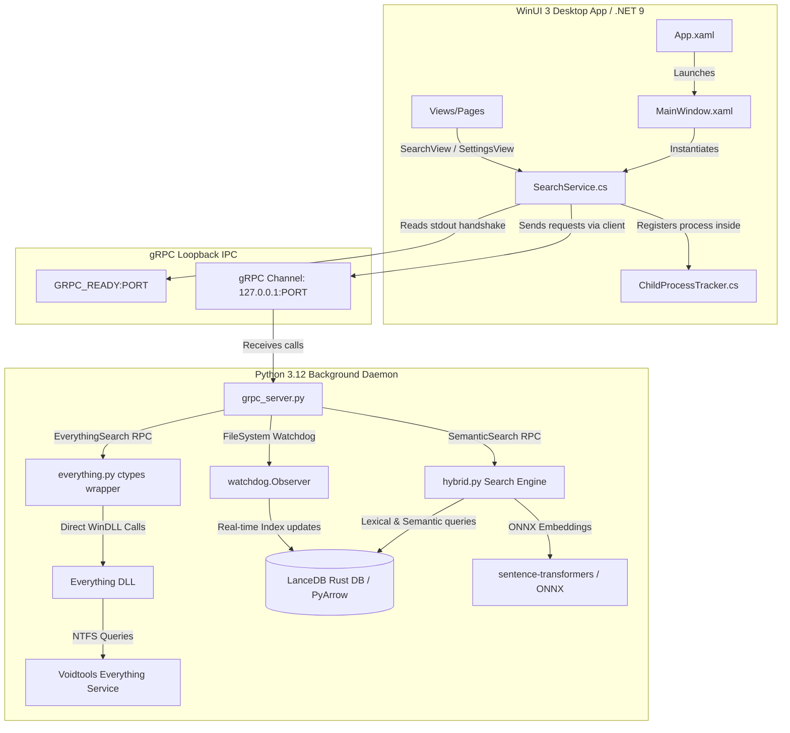

# SwiftSearch

SwiftSearch is a high-performance, local-first hybrid and semantic search utility designed specifically for Windows 10 and 11 systems. It delivers near-instantaneous search latency ($\le 100\text{ ms}$) and maintains a low memory footprint ($\le 150\text{ MB}$ RAM idle), running completely offline to preserve privacy. The application couples an offline neural vector store with the Windows NTFS index, wrapped in a Fluent WinUI 3 desktop dashboard.

---

## Technical Architecture Overview

SwiftSearch leverages a decoupled, multi-process architecture to separate high-performance C# WinUI 3 interface elements from the Python 3.12 local AI and vector database engines. Communication between these layers is handled via high-speed, strongly-typed gRPC loopback IPC.



### 1. Frontend: C# / WinUI 3 / .NET 9
* **Fluent Presentation Layer:** Tailored to Windows 11 design guidelines, featuring modern glassmorphism UI cards, extension-aware Segoe MDL2 icon glyphs, and dynamic brush theme maps.
* **Non-Blocking UI Threading:** Search queries and indexing operations run asynchronously using `.NET 9` tasks (`async/await`), ensuring the interface remains fully responsive.
* **Diagnostics Interface:** Features a dedicated diagnostics hub streaming daemon logs (`stdout`/`stderr`), real-time CPU/RAM footprint tracking, and loopback socket ping metrics.

### 2. IPC: gRPC Loopback Protocol & Dynamic Handshake
* **Type-Safe Service Contracts:** The communication contract defined in `service.proto` compiles down to strongly-typed stubs in both C# and Python.
* **Zero-Configuration Port Allocation:** To eliminate port conflicts and firewall warnings, the daemon binds its gRPC listener to port `0`. The Windows OS dynamically assigns the first available ephemeral port. The daemon flushes the string `GRPC_READY:<PORT>` to `stdout`, which the C# client intercepts upon launch to establish connection coordinates securely.
* **Process Lifetime Management:** Standard child processes can easily become orphaned if the parent application crashes. SwiftSearch solves this by wrapping the background Python daemon inside a native Windows **Job Object** with `JOB_OBJECT_LIMIT_KILL_ON_JOB_CLOSE` enabled. If the WinUI 3 app is closed or terminates unexpectedly, the Windows kernel immediately terminates the entire process tree.

### 3. Backend: Python 3.12 Local Search Daemon
* **Vector Store & Keyword Search:** Anchored by LanceDB, a modern, Rust-backed serverless vector database operating directly on Apache Arrow buffers.
* **Neural Embedding Engine:** Performs local CPU embedding generation via ONNX Runtime and `sentence-transformers`, with thread limits capped at 4 (`torch.set_num_threads(4)`) to minimize system stutter.

---

## Everything SDK Deep Dive

SwiftSearch achieves instant filesystem queries by interfacing directly with the native Windows NTFS index via the **Voidtools Everything SDK**. This allows the application to query the Master File Table (MFT) and USN Journal in microseconds, bypassing standard recursive OS directory listing calls.

### 1. Architectural Integration
The backend daemon dynamically interacts with Voidtools' background Everything service through a highly optimized Python ctypes integration (`backend/src/everything.py`).

```
+------------------+       gRPC IPC       +-----------------------+
|  WinUI 3 Client  | <==================> |  grpc_server.py (Py)  |
+------------------+                      +-----------------------+
                                                      |
                                                      | Instantiates
                                                      v
+------------------+      ctypes WinDLL   +-----------------------+
| Everything64.dll | <------------------- |  everything.py (Py)   |
+------------------+                      +-----------------------+
        |
        | IPC Inter-process Communication
        v
+-----------------------------+
| Voidtools Background Service| ===> Reads NTFS MFT / USN Journal
+-----------------------------+
```

### 2. Dynamic DLL Resolution and Binding
Upon initialization, the daemon inspects the Python interpreter architecture (64-bit vs 32-bit) and dynamically loads the appropriate native binary (`Everything64.dll` or `Everything32.dll`) from the local `Everything-SDK/dll` subdirectory:

```python
is_64bit = sys.maxsize > 2**32
dll_name = "Everything64.dll" if is_64bit else "Everything32.dll"
dll_path = os.path.join(root_dir, "Everything-SDK", "dll", dll_name)
self.dll = ctypes.WinDLL(dll_path)
```

The wrapper binds low-level C functions to typed interfaces using Python `ctypes`:

* **`Everything_SetSearchW`**: Sets the wide-character search query.
* **`Everything_SetRequestFlags`**: Configures return columns (`EVERYTHING_REQUEST_FULL_PATH_AND_FILE_NAME = 0x00000004`).
* **`Everything_SetMax`**: Caps the return count at `top_k` to avoid CPU allocation bottlenecks.
* **`Everything_QueryW`**: Executes a synchronous query against the resident Everything DB index.
* **`Everything_GetNumResults`**: Retrieves the number of matches returned.
* **`Everything_GetResultFullPathNameW`**: Extracts the absolute file path into an allocated unicode buffer.
* **`Everything_IsDBLoaded`**: Validates whether the background NTFS index database is active.
* **`Everything_GetLastError`**: Catches low-level operational fault codes.

### 3. Folder Whitelist Scoping
To restrict search results to directories monitored by the user's active watchlist, the wrapper automatically constructs parent-scoped filter query prefixes. Multiple paths are grouped using Everything's native boolean OR operators:

```python
# Translates a search for 'report' in folders 'C:\Codes' and 'D:\Docs' to:
# <"C:\Codes" | "D:\Docs"> report
if folder_paths:
    valid_paths = [os.path.normpath(p) for p in folder_paths if p.strip()]
    if valid_paths:
        path_clause = " | ".join(f'"{p}"' for p in valid_paths)
        query = f"<{path_clause}> {query}"
```

---

## Core Algorithms and Search Mechanics

SwiftSearch operates on a hybrid indexing structure, combining concept-based semantic search with literal keyword matching and fallback execution paths.

### 1. Neural Embedding and Model Lifecycle
Users can configure and toggle between different neural models directly from the UI:
* **`BAAI/bge-small-en-v1.5` (Default):** A 384-dimensional dense retriever (~130MB weights). Highly optimized for fast CPU inference.
* **`nomic-ai/nomic-embed-text-v1.5` (Upgrade option):** A 768-dimensional model supporting larger context windows, suitable for rich documents and code repositories.

For model downloads:
1. The WinUI interface initiates a streaming gRPC `DownloadModel` RPC.
2. The server spawns a daemon thread executing Hugging Face's `snapshot_download`.
3. A custom `ProgressTracker` monkey-patches `tqdm`'s output streams to intercept byte increments, streaming real-time percentage indicators back to the client.
4. The client's XAML UI intercepts the streams and updates the progress indicator.

### 2. Lexical & Semantic Hybrid Search (RRF)
When a hybrid search is triggered, LanceDB simultaneously runs:
1. **Dense Vector Search:** Translates the search term to an embedding vector and performs an approximate nearest neighbor (ANN) search.
2. **Lexical Full-Text Search (FTS):** Runs a traditional BM25 keyword match over the text chunk database.

The results are merged inside LanceDB's Rust engine using a **Reciprocal Rank Fusion (RRF)** reranker:

$$\text{RRF\_Score}(d) = \sum_{m \in M} \frac{1}{60 + r_m(d)}$$

Where $M$ represents the search models (Vector and FTS), and $r_m(d)$ is the rank of document $d$ inside model $m$.

#### Dynamic Match Normalization
Raw RRF rank scores fall into low ranges (typically $\le 0.033$). SwiftSearch translates these raw scores into high-fidelity match percentages displayed in the UI:

$$\text{Scaled\_Score} = \text{min}\left(0.99, \text{max}\left(0.50, 0.50 + 15.0 \times \text{Score}\right)\right)$$

This scales and caps match confidence cleanly between **`50.0%` and `99.0%`**.

### 3. Bulletproof Fallback Search
If the Full-Text Search index is not yet initialized or is empty, the engine gracefully catches the error and executes a pure vector distance fallback query. It converts L2-squared distances (`_distance`) to Cosine Similarity (`sim`):

$$\text{sim} = \text{min}\left(1.0, \text{max}\left(0.0, 1.0 - \frac{\text{_distance}}{2.0}\right)\right)$$

This similarity is scaled into the same clean matching range:

$$\text{Scaled\_Score} = \text{min}\left(0.99, \text{max}\left(0.50, 0.50 + 0.49 \times \text{sim}\right)\right)$$

### 4. Debounced Watchdog File Observer
Real-time index updates are managed by a file watchdog (`watchdog.Observer`) running in a background daemon thread. The observer captures local filesystem change events (`created`, `modified`, `deleted`) on the monitored watchlists. Real-time updates are debounced and processed in batches to protect system performance from sudden disk-write spikes (e.g. during a build task or package install).

---

## Directory Structure

```text
├── Everything-SDK/           # Voidtools Everything C-SDK header & binary dependencies
│   ├── dll/                  # Native library binaries (Everything32, Everything64, etc.)
│   ├── include/              # C++ headers for Everything interface
│   └── lib/                  # Static linker libraries
├── backend/                  # Python 3.12 gRPC daemon (indexing, embedding, vector DB)
│   ├── proto/                # Language-agnostic Protobuf definitions (.proto & compiled stubs)
│   ├── src/                  # Core Python backend files
│   │   ├── config.py         # Persistent configuration manager (JSON storage)
│   │   ├── db.py             # LanceDB connection, schemas, and table creation
│   │   ├── everything.py     # Voidtools Everything SDK ctypes bindings
│   │   ├── grpc_server.py    # Main gRPC server serving IPC calls
│   │   ├── hybrid.py         # BM25 Lexical & Semantic RRF search engine
│   │   ├── model.py          # Local ONNX model loading and embedding extraction
│   │   ├── parser.py         # File format extraction (DOCX, PDF, plaintext)
│   │   └── scanner.py        # Filesystem crawler and active directory watchdog
│   └── tests/                # Unit test suites verifying search and parsing
└── frontend/                 # WinUI 3 desktop application (.NET 9)
    └── SwiftSearch/
        ├── Core/             # P/Invoke Windows integrations (Job Objects, process tracking)
        ├── Models/           # Search models, extension-to-color, and glyph mappings
        ├── Protos/           # C# compiled Protobuf stubs
        ├── Services/         # Daemon lifetime controller and gRPC client
        ├── ViewModels/       # MVVM state binding structures
        └── Views/            # Beautiful Fluent XAML user views
```

---

## Getting Started

### Prerequisites
* **Windows 10 / 11**
* **Python 3.12+** (added to system PATH)
* **.NET 9 SDK** (or Visual Studio 2022 with the .NET Desktop Development workload)
* **Voidtools Everything Service** (ensure the Everything service is installed and running in the background for filename searches)

---

### Step 1: Initialize the Python Backend
1. Open PowerShell and navigate to the project's backend directory:
   ```powershell
   cd "backend"
   ```
2. Run the environment setup script to create a virtual environment (`.venv`) and install dependency packages (including LanceDB, PyArrow, sentence-transformers, and pyinstaller):
   ```powershell
   .\setup_env.bat
   ```
3. Run the unit test suite to verify the daemon services and Everything bindings function correctly:
   ```powershell
   .venv\Scripts\python.exe -m unittest discover -s tests
   ```

---

### Step 2: Compile & Run the WinUI 3 Frontend
1. Navigate to the C# project directory:
   ```powershell
   cd "../frontend/SwiftSearch"
   ```
2. Restore NuGet dependencies and compile the desktop application:
   ```powershell
   dotnet build
   ```
3. Launch the application:
   ```powershell
   dotnet run
   ```

---

## Configuration & Persistent Storage

All user settings, directory exclusions, extension filter rules, and monitored folder paths are persisted in a JSON file located at:

```
%USERPROFILE%\AppData\Local\SwiftSearch\config.json
```

### UI-Controlled Settings
* **Model Configurations:** Switch embedding models between standard (`BAAI/bge-small-en-v1.5`) and upgrade (`nomic-ai/nomic-embed-text-v1.5`) modes.
* **Directory Exclusions:** Omit directory patterns (e.g. `node_modules`, `.git`, `bin`, `obj`) to minimize crawler times and vector database sizes.
* **Extension Filters:** Restrict index crawling to specific matching file types (e.g., `.txt`, `.md`, `.pdf`, `.json`, `.cs`, `.py`).
* **Active Watchdogs:** Add or remove directories from real-time monitoring lists.
