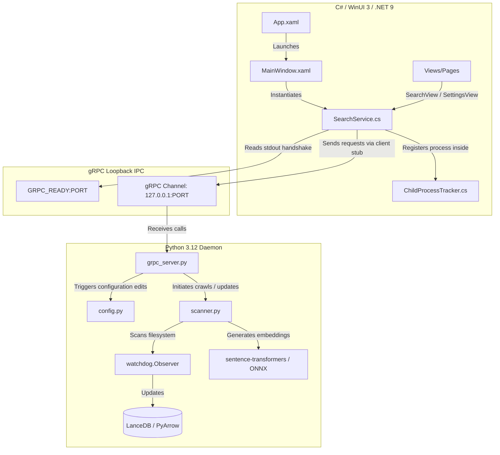

# ⚡ SwiftSearch

**SwiftSearch** is an ultra-fast, local-first semantic and hybrid search utility designed for Windows 11. It delivers lightning-fast retrieval latency ($\le 100\text{ ms}$) and has an extremely light memory footprint ($\le 150\text{ MB}$ RAM), executing 100% offline with a premium Fluent WinUI 3 dashboard.

---

## 🚀 Key Features

* **🧠 Concept-Based Semantic Search:** Go beyond keyword matching. SwiftSearch matches documents based on conceptual intent using local vector embeddings (`BAAI/bge-small-en-v1.5` as default and `Nomic-Embed-Text-v1.5` as a settings-toggle upgrade).
* **🎛️ Hybrid Search & RRF:** Combines vector similarity retrieval with traditional BM25 lexical search (FTS5) natively inside the LanceDB Rust backend using Reciprocal Rank Fusion (RRF) for optimal relevancy.
* **🛡️ Windows Job Objects Integration:** Standard child processes can easily leak if the parent crashes. SwiftSearch wraps the Python background daemon inside native Windows Job Objects (`JOB_OBJECT_LIMIT_KILL_ON_JOB_CLOSE`), ensuring that if the WinUI 3 app is closed, terminated, or crashes, the Python backend is immediately reaped by the OS kernel.
* **🔌 Zero-Configuration Dynamic Handshake:** Binds the gRPC server to port `0`, letting the Windows OS assign the first available free port. The daemon prints `GRPC_READY:<PORT>` to stdout and flushes immediately, letting the C# client intercept the port and connect securely.
* **📂 Active Directory Watchdog:** Powered by a debounced watchdog file observer that monitors watchlists. Newly added or edited files are crawled and indexed automatically; deleted files are purged in real-time.
* **✨ Fluent UI & Overlays:** Visual cues matching the Windows 11 design guidelines, featuring a glowing network status widget, active overlays during initial weight downloads, and direct system shell execution (`Process.Start` with `UseShellExecute = true`) to launch files immediately in their default registered programs.

---

## 🏗️ Architecture & Component Overview



### Component Details
1. **Frontend (`frontend/SwiftSearch`):** Built with .NET 9 and Windows App SDK (WinUI 3). Implements native shell execution, responsive async loaders, and secure UI bindings.
2. **Backend (`backend/src`):** Written in Python 3.12 using LanceDB for local vector storage, watchdog for filesystem alerts, sentence-transformers for embedding inference, and PyMuPDF for document crawling.
3. **IPC Bridge:** A low-overhead gRPC communication link using standard Proto definitions (`proto/search_engine.proto`).

---

## 🛠️ How to Build & Run Locally

### Prerequisites
* **Windows 10/11**
* **Python 3.12+** (added to your system PATH)
* **.NET 9 SDK** (or Visual Studio 2022 with the .NET Desktop Development workload)

---

### Step 1: Initialize the Python Backend
1. Open PowerShell and navigate to the project backend:
   ```powershell
   cd "backend"
   ```
2. Run the environment setup batch script. This will create a local `.venv`, upgrade pip, and install all required modules (including LanceDB, watchdog, sentence-transformers, and pyinstaller):
   ```powershell
   .\setup_env.bat
   ```
3. *(Optional)* Run the Python unit test suite to verify everything is working perfectly:
   ```powershell
   .venv\Scripts\python.exe -m unittest discover -s tests
   ```

---

### Step 2: Compile & Run the C# WinUI 3 Frontend
1. Navigate to the C# project directory:
   ```powershell
   cd "../frontend/SwiftSearch"
   ```
2. Restore NuGet dependencies and compile the solution:
   ```powershell
   dotnet build
   ```
3. Run the executable:
   ```powershell
   dotnet run
   ```

*Note: On first startup, the UI will intercept the Python daemon downloading the local `BGE-Small-EN-v1.5` weights and display a beautiful, non-blocking progress screen. Once downloaded, the application is 100% offline and lightning-fast.*

---

## ⚙️ Configuration & Customization

SwiftSearch stores all user preferences and crawled watchlists in a persistent, local configuration file located at:
`%USERPROFILE%\AppData\Local\SwiftSearch\config.json`

### Performance Tunables (via Settings Tab):
* **Model Toggle:** Switch between `BGE-Small-EN-v1.5` (~130MB, CPU-optimized for $\le 100\text{ ms}$ budget) and `Nomic-Embed-Text-v1.5` (768 dimensions for extremely large codebases).
* **Exclusion Directories:** Exclude heavy, unneeded subfolders (e.g. `node_modules`, `.git`, `bin`, `obj`) to keep indices lightweight.
* **Extension Filters:** Narrow crawls to specific file extensions (e.g. `.txt`, `.md`, `.pdf`, `.json`, `.cs`, `.py`).
