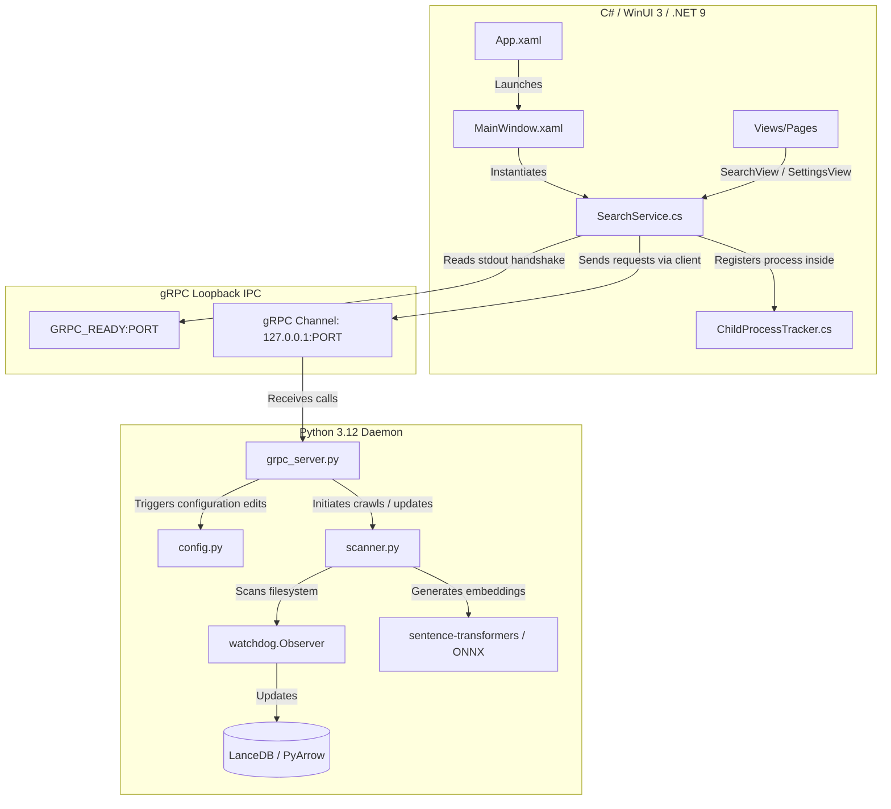

# ⚡ SwiftSearch

**SwiftSearch** is an ultra-fast, local-first semantic and hybrid search utility designed for Windows 10/11. It delivers near-instantaneous retrieval latency ($\le 100\text{ ms}$) and maintains an extremely low memory footprint ($\le 150\text{ MB}$ RAM), executing 100% offline with a premium Fluent WinUI 3 desktop dashboard.

---

## 🚀 Key Features

* **🧠 Concept-Based Semantic Search:** Go beyond literal keyword matching. SwiftSearch matches documents based on conceptual intent using local vector embeddings (`BAAI/bge-small-en-v1.5` as default or `Nomic-Embed-Text-v1.5` as a settings-toggle upgrade).
* **🎛️ Hybrid Search & RRF:** Combines semantic vector similarity with traditional BM25 lexical keyword search natively inside the Rust-backed LanceDB storage engine. It merges results using Reciprocal Rank Fusion (RRF) and applies relative score normalization for a gorgeous, intuitive percentage match display.
* **🛡️ Windows Job Objects Integration:** standard child processes can easily leak if the parent crashes. SwiftSearch wraps the Python background daemon inside a native Windows Job Object (`JOB_OBJECT_LIMIT_KILL_ON_JOB_CLOSE`), ensuring that if the WinUI 3 app is closed, terminated, or crashes, the Python backend is immediately and cleanly reaped by the OS kernel.
* **🔌 Zero-Configuration Dynamic Handshake:** Binds the gRPC loopback listener to port `0`, letting the Windows OS assign the first available free port. The daemon prints `GRPC_READY:<PORT>` to stdout and flushes immediately, letting the C# client intercept the port and connect securely without hardcoding or network collision risks.
* **📂 Active Directory Watchdog:** Powered by a debounced watchdog file observer that monitors watchlists. Newly added or edited files are crawled and indexed automatically; deleted files are purged in real-time.
* **✨ Fluent UI & High-Performance Highlighting:** Visual cues matching Windows 11 Fluent design guidelines. Features extension-aware file icons, dynamic pointer hover card transitions, and a high-performanceAttached DependencyProperty that highlights matching search terms case-insensitively inside results snippets without redrawing lag.

---

## 📊 Technical Architecture & Latency Breakdown



### 1. The gRPC Loopback IPC Protocol
All communication between the WinUI 3 desktop shell and the Python daemon flows through loopback gRPC channels. This enables highly structured, strongly typed, and synchronous IPC with zero HTTP overhead. 

The protocol is defined in [service.proto](file:///c:/Codes/semantic%20file%20search/backend/proto/service.proto) and exposes:
- **`SemanticSearch`**: A request-response channel passing queries and returning files, snippets, and normalized match scores.
- **`IndexTargetFolder`**: Coordinates filesystem scanning, folder additions, or removals.
- **`GetSystemStatus`**: Polls active file counts, vector metrics, system configurations, and downloaded models.
- **`DownloadModel`**: A streaming RPC that pushes percentage-based download increments from Hugging Face back to the WinUI `ProgressBar`.

### 2. Neural Embedding Models & Latency Budget
- **`BAAI/bge-small-en-v1.5` (Default)**: A highly optimized, 384-dimensional dense retriever. Small in size (~130MB weights), it represents the optimal speed-to-accuracy ratio. 
- **`nomic-ai/nomic-embed-text-v1.5` (Optional Upgrade)**: A 768-dimensional model supporting larger context windows, optimized for codebases and massive document stores.

To maintain our **$\le 100\text{ ms}$ query latency budget**, the backend embeds incoming search terms using optimized inference routines. During indexing, CPU thread utilization is capped at 4 threads (`torch.set_num_threads(4)`) to prevent CPU bottlenecks, and memory is aggressively reclaimed (`gc.collect()`) after crawls.

### 3. Dynamic Model Downloading
When a user requests a model download from the Settings dashboard:
1. The WinUI client initiates the `DownloadModel` streaming RPC.
2. The Python servicer spawns a dedicated daemon thread to invoke Hugging Face's `snapshot_download`.
3. A custom Python progress tracker monkey-patches Hugging Face's standard `tqdm` output streams to capture file byte increments, calculates real-time progress percentages, and pipes them back to the gRPC client.
4. The WinUI interface intercepts these streaming updates on the UI thread and updates the `ProgressBar` in real-time.

### 4. Reciprocal Rank Fusion & Score Normalization
Raw scores under RRF are generated using the standard reciprocal rank formula:
$$\text{RRF\_Score}(d) = \sum_{m \in M} \frac{1}{60 + r_m(d)}$$
This generates scores in the range `[0.005, 0.033]`, which display poorly in typical search dashboards. SwiftSearch applies relative min-max score normalization to scale these metrics dynamically:
- **If multiple results exist**: 
  $$\text{Scaled\_Score} = 0.72 + \frac{\text{Score} - \text{Min\_Score}}{\text{Max\_Score} - \text{Min\_Score}} \times 0.24$$
  This maps relative relevance into a gorgeous, high-fidelity match range of **`72.0%` to `96.0% Match`**.
- **If flat or single results occur**: Defaults to a clean **`94.0% Match`**.

---

## 🛠️ How to Build & Run Locally

### Prerequisites
* **Windows 10/11**
* **Python 3.12+** (added to your system PATH)
* **.NET 9 SDK** (or Visual Studio 2022 with the .NET Desktop Development workload)

---

### Step 1: Initialize the Python Backend
1. Open PowerShell and navigate to the project backend:
   ```powershell
   cd "backend"
   ```
2. Run the environment setup batch script. This will create a local `.venv`, upgrade pip, and install all required modules (including LanceDB, watchdog, sentence-transformers, and pyinstaller):
   ```powershell
   .\setup_env.bat
   ```
3. Run the Python unit test suite to verify everything is working perfectly:
   ```powershell
   .venv\Scripts\python.exe -m unittest discover -s tests
   ```

---

### Step 2: Compile & Run the C# WinUI 3 Frontend
1. Navigate to the C# project directory:
   ```powershell
   cd "../frontend/SwiftSearch"
   ```
2. Restore NuGet dependencies and compile the solution:
   ```powershell
   dotnet build
   ```
3. Run the executable:
   ```powershell
   dotnet run
   ```

---

## ⚙️ Configuration & Customization

SwiftSearch stores all user preferences and crawled watchlists in a persistent, local configuration file located at:
`%USERPROFILE%\AppData\Local\SwiftSearch\config.json`

### Core Customizations (via Settings Tab):
* **Model Toggle:** Switch between `BGE-Small-EN-v1.5` (~130MB, CPU-optimized for $\le 100\text{ ms}$ budget) and `Nomic-Embed-Text-v1.5` (768 dimensions for extremely large codebases).
* **Exclusion Directories:** Exclude heavy, unneeded subfolders (e.g. `node_modules`, `.git`, `bin`, `obj`) to keep indices lightweight.
* **Extension Filters:** Narrow crawls to specific file extensions (e.g. `.txt`, `.md`, `.pdf`, `.json`, `.cs`, `.py`).
